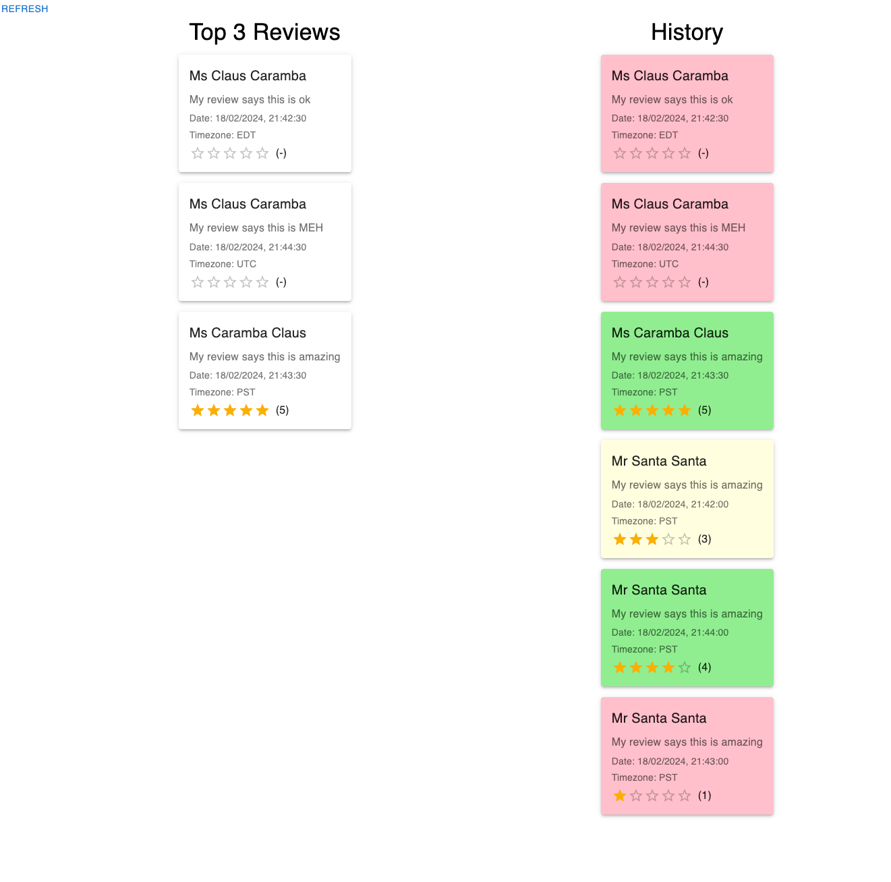

# TopReviews - Insightful Review Analytics Platform

Welcome to TopReviews, an engaging web application crafted to provide in-depth analytics on customer reviews. This application is built upon a robust tech stack that includes React, Vite, Material-UI (MUI), and Redux Toolkit for the frontend, complemented by Node.js and NestJS for backend operations. TopReviews boasts a sleek, responsive user interface and employs efficient, scalable server-side logic to deliver a comprehensive review analysis experience.



## Features

- **Timely Review Insights**: Seamlessly fetches and displays the top 3 reviews, offering up-to-date insights into customer feedback.
- **Efficient Caching**: Leverages a backend caching mechanism to enhance data retrieval efficiency, significantly reducing the load on the simulated 3rd party API.
- **Refresh on Demand**: Equipped with a mechanism to refresh review data periodically, ensuring that the latest information is always at your disposal without needing manual intervention.
- **Review History Tracking**: Features a scrollable history of top reviews, color-coded by rating, to provide quick sentiment analysis at a glance.
- **Adaptive User Interface**: The fully responsive design guarantees a smooth user experience on a variety of devices, from large-screen desktops to compact smartphones.
- **Persistent Review History**: Implements data persistence for review history, ensuring that insights remain accessible even after a page refresh.
- **Enhanced Data Analysis Tools**: Includes additional functionalities like sorting the review history by rating and calculating average ratings, enriching the analytical depth of the platform.

## Getting Started

To get a local copy up and running, follow these simple steps.

### Prerequisites

- Node.js (v18 or later recommended)
- A modern web browser

### Installation

1. Clone the repo
```zsh
git clone https://github.com/<your-username>/TopReviews.git
```
2. Install NPM packages and start the app
```zsh
cd server
pnpm install
pnpm start
```
```zsh
cd client
npm install
npm run dev
```

## Usage

- Access the web app at [http://localhost:8080](http://localhost:8080).
- Use the "Refresh" button to manually fetch the latest top 3 reviews.
- Observe the automatic update of reviews every 30 seconds.
- Explore the historical data of reviews, now persistently stored and visually distinguished by sentiment.

## Contributing

Contributions are what make the open-source community such an amazing place to learn, inspire, and create. Any contributions you make are **greatly appreciated**.

1. Fork the Project
2. Create your Feature Branch (`git checkout -b feature/AmazingFeature`)
3. Commit your Changes (`git commit -m 'Add some AmazingFeature'`)
4. Push to the Branch (`git push origin feature/AmazingFeature`)
5. Open a Pull Request

## License

Distributed under the MIT License. See `LICENSE` for more information.

## Acknowledgements

- [NestJS](https://nestjs.com/) for the powerful backend framework.
- [React](https://reactjs.org/) for the flexible frontend library.
- [Redux Toolkit](https://redux-toolkit.js.org/) for state management.
- [Material-UI](https://mui.com/) for the sleek UI components.
- [Vite](https://vitejs.dev/) for the blazing fast build tool.
